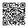

# Donate

Glyph is free and open source. If it is useful to you, donations are welcome via crypto:

| Network | Asset | Address |
|---|---|:---:|
| BNB Smart Chain (BEP-20) | USDT |   `0x1ccE8122253BD823eB52d50E127DfB6a744bb399`   |
| Solana | SOL |   `AT3HGaCYMRD3CZCqWnxMfdFAcS7Kmjp5pocip7Edc3r4`   |
| Tron (TRC-20) | USDT |   `TZJQzAPtcxnACyZNKbPG7yrzmdjDV4jVce`   |

Send only the listed asset on the listed network. Anything else sent to these addresses may be lost.
