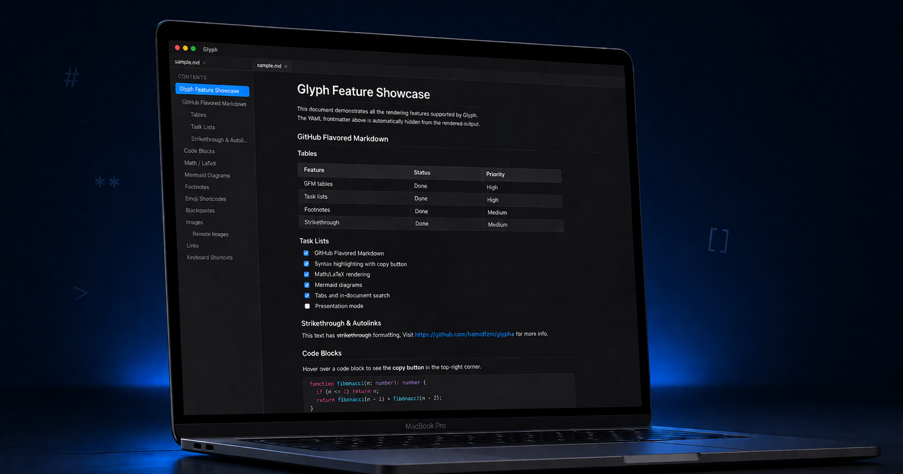

# Glyph

[](https://github.com/hamidfzm/glyph/actions/workflows/ci.yml)
[](https://codecov.io/gh/hamidfzm/glyph)

A modern, cross-platform markdown viewer and editor with platform-native styling.

Built with [Tauri v2](https://v2.tauri.app), React 19, and TypeScript.



## Demo


## Try It

The [`samples/`](samples) directory is a tiny demo workspace — open it as a folder (`Cmd/Ctrl+Shift+O`) to see every rendering feature plus working wikilinks. [`samples/README.md`](samples/README.md) is the showcase document; the surrounding files exist so its `[[wikilinks]]` resolve.

## Features

### Markdown Rendering
- GitHub Flavored Markdown — tables, task lists, strikethrough, autolinks, footnotes
- GitHub-style alerts — `> [!NOTE]`, `[!TIP]`, `[!IMPORTANT]`, `[!WARNING]`, `[!CAUTION]`
- Heading anchor links — every heading gets a GitHub-compatible slug; `[text](#heading)` scrolls smoothly to the target
- Wikilinks — `[[note]]`, `[[note|alias]]`, `[[note#heading]]` resolve against the open folder workspace; broken links render with a distinct style
- Backlinks panel — sidebar list of every workspace note that links to the current file, with surrounding-line snippets
- Syntax highlighting for code blocks (6 themes: Glyph, GitHub, Monokai, Nord, Solarized Light/Dark)
- Copy button on code blocks
- Math/LaTeX rendering — inline (`$...$`) and block (`$$...$$`) equations via KaTeX
- Mermaid diagrams — flowcharts, sequence diagrams, Gantt charts, and more (theme-aware)
- Inline HTML — `<kbd>`, `<sub>`, `<sup>`, `<details>`, alignment attributes (sanitised allowlist)
- YAML frontmatter — title, author, date, and tags render as a metadata block above the document; tags get a per-tag colour
- Emoji shortcodes — `:smile:` → 😊, `:+1:` → 👍
- Local and remote image display
- External links open in system browser with optional confirmation dialog

### Editor
- Markdown editor mode — syntax highlighting, line numbers, undo/redo history
- Split view — edit and preview side-by-side, or switch between modes per tab
- Live preview updates as you type
- Wikilink autocomplete — type `[[` in a folder workspace to pick from existing notes; Tab/Enter to insert

### Viewer
- Folder / workspace tabs — open a folder as a tab; browse `.md` files in the sidebar tree; right-click a file to open it in a new top-level tab
- Multiple files in tabs — open, switch, close, middle-click to close
- In-document search — `Cmd/Ctrl+F` with match highlighting and navigation
- Zoom in/out — `Cmd/Ctrl+=/-/0` with zoom level in status bar
- Table of Contents sidebar with active heading tracking
- Print & PDF export — `Cmd/Ctrl+P` with configurable page breaks, optional TOC, and theme-color control
- Live reload — file watcher auto-updates on external changes
- Drag and drop markdown files or folders to open
- File associations — double-click `.md` files to open in Glyph
- CLI support — `glyph README.md` opens a file; `glyph ~/notes/` opens a folder as a workspace
- Recent files list
- Session restore — open tabs persist across restarts

### Appearance
- System / Light / Dark themes
- Customizable font family, size, line height, and content width
- Custom code font support
- Platform-native styling (macOS vibrancy, Windows Mica)

### AI (optional)
- Summarize, explain, translate, and simplify documents
- Providers: Claude, OpenAI, Ollama (local)
- Text-to-speech with configurable voice and speed

### Platform
- Cross-platform: macOS (universal), Windows (x64), Linux (amd64 + arm64)
- Window state persistence across restarts
- Native menu bar with keyboard shortcuts

## Install

### macOS (Homebrew)

```bash
brew tap hamidfzm/tap
brew install --cask glyph
```

### Windows (Chocolatey)

```powershell
choco install glyph
```

### Windows (Scoop)

```powershell
scoop bucket add hamidfzm https://github.com/hamidfzm/scoop-bucket
scoop install glyph
```

### Arch Linux (AUR)

```bash
yay -S glyph-md-bin
```

### Linux (Homebrew)

```bash
brew tap hamidfzm/tap
brew install glyph
```

### Debian/Ubuntu (PPA)

```bash
sudo add-apt-repository ppa:hamidfzm/glyph
sudo apt update
sudo apt install glyph
```

### Debian

```bash
curl -fsSL https://hamidfzm.github.io/apt-repo/gpg.key | sudo gpg --dearmor -o /usr/share/keyrings/glyph.gpg
echo "deb [signed-by=/usr/share/keyrings/glyph.gpg] https://hamidfzm.github.io/apt-repo stable main" | sudo tee /etc/apt/sources.list.d/glyph.list
sudo apt update
sudo apt install glyph
```

### Linux (manual)

Download the `.deb` or `.AppImage` from [Releases](https://github.com/hamidfzm/glyph/releases).

```bash
# Debian/Ubuntu
sudo dpkg -i glyph_*.deb

# AppImage
chmod +x Glyph_*.AppImage
./Glyph_*.AppImage
```

## Development

```bash
pnpm install
pnpm tauri dev
```

Open a file or folder via CLI argument:

```bash
pnpm tauri dev -- -- /path/to/file.md
pnpm tauri dev -- -- /path/to/folder
```

Build for production:

```bash
pnpm tauri build
```

### Testing

```bash
pnpm test                       # Run frontend tests (Vitest)
pnpm test:coverage              # Run with coverage report
cd src-tauri && cargo test      # Run Rust tests
```

### Linting & Formatting

```bash
pnpm lint                       # Lint TypeScript (Biome)
pnpm format:check               # Check formatting (Biome)
pnpm check                      # Lint + format + organize imports
cd src-tauri && cargo clippy    # Lint Rust
```

## Keyboard Shortcuts

| Shortcut | Action |
|----------|--------|
| `Cmd+O` / `Ctrl+O` | Open file(s) |
| `Cmd+Shift+O` / `Ctrl+Shift+O` | Open folder |
| `Cmd+P` / `Ctrl+P` | Print / Export to PDF |
| `Cmd+F` / `Ctrl+F` | Find in document |
| `Cmd+=` / `Ctrl+=` | Zoom in |
| `Cmd+-` / `Ctrl+-` | Zoom out |
| `Cmd+0` / `Ctrl+0` | Reset zoom |
| `Cmd+B` / `Ctrl+B` | Toggle files sidebar |
| `Cmd+\` / `Ctrl+\` | Toggle outline sidebar |
| `Cmd+,` / `Ctrl+,` | Settings |
| `Cmd+W` / `Ctrl+W` | Close tab |
| `Cmd+Shift+W` / `Ctrl+Shift+W` | Close window |

## Comparison with Other Markdown Apps

Glyph is built around speed, native feel, and offline-first usage. The tables below compare its current capabilities against widely used markdown apps. Items marked "planned" track to issues on the [roadmap](https://github.com/hamidfzm/glyph/issues).

### Rendering

| Feature | Glyph | Obsidian | Typora | MarkText | Zettlr | Joplin | VS Code |
|---|---|---|---|---|---|---|---|
| GitHub Flavored Markdown | ✅ | ✅ | ✅ | ✅ | ✅ | ✅ | ✅ |
| Math (KaTeX/MathJax) | ✅ | ✅ | ✅ | ✅ | ✅ | ✅ | plugin |
| Mermaid diagrams | ✅ | ✅ | ✅ | ✅ | ⚠️ | ✅ | plugin |
| Syntax-highlighted code | ✅ (6 themes) | ✅ | ✅ | ✅ | ✅ | ✅ | ✅ |
| GitHub-style alerts | ✅ | ✅ | ⚠️ | ❌ | ❌ | ⚠️ | ✅ |
| YAML frontmatter | ✅ | ✅ | ✅ | ✅ | ✅ | ⚠️ | ✅ |
| Emoji shortcodes | ✅ | ✅ | ✅ | ✅ | ❌ | ✅ | plugin |

### Editing

| Feature | Glyph | Obsidian | Typora | MarkText | Zettlr | Joplin | VS Code |
|---|---|---|---|---|---|---|---|
| Source editor | ✅ | ✅ | n/a | ✅ | ✅ | ✅ | ✅ |
| WYSIWYG / inline preview | ⚠️ | ✅ | ✅ | ✅ | ⚠️ | ⚠️ | ❌ |
| Split view | ✅ | ✅ | ❌ | ✅ | ✅ | ✅ | ✅ |
| Spell check | planned | ✅ | ✅ | ✅ | ✅ | ✅ | ✅ |

### Navigation

| Feature | Glyph | Obsidian | Typora | MarkText | Zettlr | Joplin | VS Code |
|---|---|---|---|---|---|---|---|
| Tabs | ✅ | ✅ | ❌ | ✅ | ✅ | ❌ | ✅ |
| Folder / vault sidebar | ✅ | ✅ | ⚠️ | ✅ | ✅ | ✅ | ✅ |
| Wikilinks & backlinks | ✅ | ✅ | ❌ | ❌ | ✅ | ❌ | plugin |
| Tag / metadata search | planned | ✅ | ❌ | ❌ | ✅ | ✅ | plugin |
| Command palette | planned | ✅ | ❌ | ❌ | ❌ | ❌ | ✅ |
| In-document search | ✅ | ✅ | ✅ | ✅ | ✅ | ✅ | ✅ |
| Table of contents | ✅ | ✅ | ✅ | ✅ | ✅ | ✅ | ✅ |
| Live reload on disk change | ✅ | ⚠️ | n/a | n/a | ⚠️ | n/a | ✅ |

### Output

| Feature | Glyph | Obsidian | Typora | MarkText | Zettlr | Joplin | VS Code |
|---|---|---|---|---|---|---|---|
| Print | ✅ | ✅ | ✅ | ✅ | ✅ | ✅ | ✅ |
| Export PDF | ✅ | ✅ | ✅ | ✅ | ✅ | ✅ | plugin |
| Export HTML / DOCX / EPUB | planned | plugin | ✅ (Pandoc) | ⚠️ | ✅ (Pandoc) | ⚠️ | plugin |

### Power features

| Feature | Glyph | Obsidian | Typora | MarkText | Zettlr | Joplin | VS Code |
|---|---|---|---|---|---|---|---|
| AI (multi-provider, local) | ✅ | plugin | ❌ | ❌ | ❌ | ❌ | plugin |
| Text-to-speech | ✅ | plugin | ❌ | ❌ | ❌ | ❌ | plugin |
| Plugin / extension API | planned | ✅ | ❌ | ❌ | ⚠️ | ✅ | ✅ |
| Cloud sync | planned | paid | ❌ | ❌ | ❌ | ✅ | ✅ |
| Graph view | ❌ | ✅ | ❌ | ❌ | ❌ | ❌ | plugin |

### Platform

| Feature | Glyph | Obsidian | Typora | MarkText | Zettlr | Joplin | VS Code |
|---|---|---|---|---|---|---|---|
| Native window styling | ✅ (vibrancy/Mica) | ⚠️ | ⚠️ | ⚠️ | ⚠️ | ⚠️ | ⚠️ |
| Native bundle (non-Electron) | ✅ Tauri (~3 MB core) | ❌ | ✅ Qt | ❌ | ❌ | ❌ | ❌ |
| macOS / Windows / Linux | ✅ | ✅ | ✅ | ✅ | ✅ | ✅ | ✅ |
| Mobile (iOS / Android) | planned | ✅ | ❌ | ❌ | ❌ | ✅ | ❌ |
| File associations + CLI | ✅ | ⚠️ | ✅ | ⚠️ | ⚠️ | ❌ | ✅ |
| Open source | ✅ MIT | ❌ | ❌ | ✅ | ✅ | ✅ | ✅ |
| Free | ✅ | ✅ | $14.99 | ✅ | ✅ | ✅ | ✅ |

Legend: ✅ supported · ⚠️ partial / inconsistent · ❌ not supported · plugin = third-party · planned = on roadmap

Note on "WYSIWYG / inline preview": Glyph's editor has split-view live preview and styled markdown tokens (bold/italic render as bold/italic in source), but markdown markers remain visible — Typora-style fully inline rendering is not implemented.

## License

[MIT](LICENSE)
