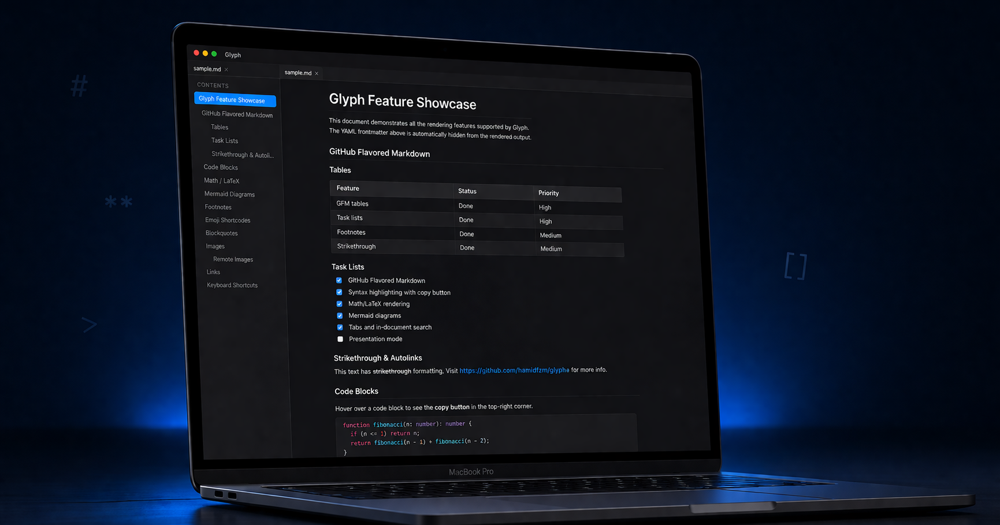

# Glyph

[](https://github.com/hamidfzm/glyph/actions/workflows/ci.yml)
[](https://github.com/hamidfzm/glyph/actions/workflows/release.yml)
[](https://github.com/hamidfzm/glyph/actions/workflows/security.yml)
[](https://codecov.io/gh/hamidfzm/glyph)
[](https://github.com/hamidfzm/glyph/releases/latest)
[](https://github.com/hamidfzm/glyph/releases)
[](LICENSE)
[](https://v2.tauri.app)
[](https://react.dev)
[](https://biomejs.dev)

A modern, cross-platform markdown viewer and editor with platform-native styling.

Built with [Tauri v2](https://v2.tauri.app), React 19, and TypeScript.



## Demo


## Try It

The [`samples/`](samples) directory is a tiny demo workspace. Open it as a folder (`Cmd/Ctrl+Shift+O`) to see every rendering feature plus working wikilinks. [`samples/README.md`](samples/README.md) is the showcase document; the surrounding files exist so its `[[wikilinks]]` resolve.

## Features

### Markdown Rendering
- GitHub Flavored Markdown, alerts, footnotes, heading anchors, and emoji shortcodes
- Wikilinks and backlinks with hover preview and inline note embeds (`[[note]]`, `![[note]]`)
- Math (KaTeX), Mermaid and D2 diagrams, CSV/TSV tables, and syntax-highlighted code (6 themes)
- YAML frontmatter, sanitised inline HTML, and bidirectional (RTL) text
- Local and remote images with a zoomable lightbox, plus inline video and audio playback
- Per-syntax toggles in Settings → Markdown

### Editor
- Source, split, and live-preview modes per tab
- New untitled (in-memory) documents (`Cmd/Ctrl+N`), save with `Cmd/Ctrl+S`, and an optional Auto Save toggle
- Format toolbar, inline formatting shortcuts, and wrap-selection
- Wikilink autocomplete, spell check, and Vim/VSCode keymaps
- Undo/redo for programmatic edits (task toggles, etc.)

### Workspace & Navigation
- Folder workspaces with a sidebar tree, tabs, and create/rename/move/delete; create a new workspace from within the app
- Graph view (`Cmd/Ctrl+G`), command palette (`Cmd/Ctrl+K`, with `tag:` / frontmatter filters), a sidebar Tags panel, in-document search (`Cmd/Ctrl+F`), and workspace-wide full-text search with case/whole-word/regex toggles (`Cmd/Ctrl+Shift+F`)
- Table of contents, resizable panels, zoom, and session/window restore
- Drag-and-drop, file associations, and a `glyph` CLI (`glyph file.md`, `glyph ~/notes/`)

### Viewer & Export
- Jupyter notebooks (`.ipynb`) and JSON Canvas (`.canvas`) boards
- Print and export to HTML, DOCX, EPUB, and PDF (vector diagrams, self-contained, offline)
- Export a whole workspace as a static website, in-app or headless from the CLI

### Sync (experimental)
- Per-workspace, Git-backed Cloud Sync to any remote you control, with a status-bar ahead/behind/dirty pill

### Appearance
- System / Light / Dark themes and platform-native styling (macOS vibrancy, Windows Mica)
- Localized, RTL-aware UI; customizable fonts, size, line height, and content width

### AI (optional)
- Chat sidebar, quick actions (summarize, explain, translate, simplify), and text-to-speech
- Providers: Claude, OpenAI, and Ollama (local)

### Platform
- macOS, Windows, and Linux; native menu bar with remappable shortcuts and update notifications
- iOS and Android (experimental): open and read single files, with a touch layout for phones and tablets; folder workspaces are desktop-only for now
- Plugins (experimental): extend rendering, palette, status bar, dictionaries, and themes; sandboxed by default with consent-gated permissions and checksum-verified marketplace installs (see the [plugin docs](https://glyph-md.github.io/plugins/))
- Local-first with opt-in crash reporting (off by default; see [Privacy & Error Reporting](#privacy--error-reporting))

## Install

### macOS (Homebrew)

```bash
brew tap glyph-md/tap
brew trust glyph-md/tap
brew install --cask --force glyph-md/tap/glyph
```

`brew trust` is required once because Glyph ships from a third-party tap; recent Homebrew refuses to load casks from untrusted taps.

Use the fully qualified name: homebrew-core ships an unrelated `glyph` formula (an ASCII-art converter), so a plain `brew install glyph` installs that instead. If the `glyph` command prints `Error: input file must be specified.`, that formula is shadowing the app; remove it with `brew uninstall --formula glyph` and reinstall the cask. `--force` also replaces an existing `/Applications/Glyph.app` left by a DMG install or an interrupted upgrade.

### Windows (winget)

```powershell
winget install hamidfzm.Glyph
```

### Windows (Chocolatey)

```powershell
choco install glyph
```

### Windows (Scoop)

```powershell
scoop bucket add glyph-md https://github.com/glyph-md/scoop-bucket
scoop install glyph
```

### Linux (Snap)

```bash
sudo snap install glyph
```

### Arch Linux (AUR)

```bash
yay -S glyph-md-bin
```

### Linux (Homebrew)

```bash
brew tap glyph-md/tap
brew install glyph-md/tap/glyph
```

### Debian/Ubuntu (PPA)

```bash
sudo add-apt-repository ppa:hamidfzm/glyph
sudo apt update
sudo apt install glyph
```

### Debian

```bash
curl -fsSL https://glyph-md.github.io/apt-repo/gpg.key | sudo gpg --dearmor -o /usr/share/keyrings/glyph.gpg
echo "deb [signed-by=/usr/share/keyrings/glyph.gpg] https://glyph-md.github.io/apt-repo stable main" | sudo tee /etc/apt/sources.list.d/glyph.list
sudo apt update
sudo apt install glyph
```

### Fedora / RHEL (DNF)

```bash
sudo tee /etc/yum.repos.d/glyph.repo < <(curl -fsSL https://glyph-md.github.io/rpm-repo/glyph.repo)
sudo dnf install glyph
```

### Linux (manual)

Download the `.deb`, `.rpm`, or `.AppImage` from [Releases](https://github.com/hamidfzm/glyph/releases).

```bash
# Debian/Ubuntu
sudo dpkg -i glyph_*.deb

# Fedora/RHEL
sudo dnf install ./Glyph-*.rpm

# AppImage
chmod +x Glyph_*.AppImage
./Glyph_*.AppImage
```

### Command-line usage

Installing from a package manager puts a `glyph` command on your `PATH`:

```bash
glyph README.md      # open a file
glyph ~/notes/       # open a folder as a workspace
glyph --help         # usage, flags, and export formats

# export a document (headless; exits when done)
glyph README.md --export pdf              # writes README.pdf beside it
glyph notes.md --export docx --out ~/out.docx

# export a workspace as a static website
glyph ~/notes/ --export site --out ./site
```

```bash
# serve a workspace as a website, rebuilding as it changes
glyph serve ~/notes/
glyph serve ~/notes/ --port 8080          # pick the port; 0 asks the OS
glyph serve ~/notes/ --host 0.0.0.0       # let the local network read it
glyph serve ~/notes/ --out ./site         # keep the build instead of a temp dir
```

`serve` renders the folder, prints the URL, and keeps running: every change to the folder rebuilds the site, and pages open in a browser reload themselves. It binds `127.0.0.1` unless `--host` says otherwise, so nothing leaves the machine by default, and it answers only to its own hostnames so a web page cannot reach it through your browser. Everything in the output directory is served, so point `--out` at a directory of its own; without one, the site lives in a temporary directory removed when you interrupt the command. Like the exports below, it renders through a webview, so a Linux server without a display needs `xvfb-run`.

`--export` accepts `pdf`, `docx`, `epub`, `html`, and `site`. Without `--out` a document export writes beside its input with the format's extension; `site` always needs one. Exports run without showing a window, print the path they wrote to stdout, and exit nonzero with a message on stderr if they fail, so they can drive CI publishing (on Linux runners, wrap the command in `xvfb-run`). A document export includes the table of contents when Settings > Print has it enabled.

The command is provided by the Homebrew cask (macOS), Chocolatey or Scoop (Windows), and the deb package or Homebrew formula (Linux). The macOS `.dmg` and Windows MSI install the app only; use a package manager for the terminal command.

### Docker

Run the exports without installing anything, which is what a docs pipeline usually wants:

```bash
docker run --rm --user "$(id -u):$(id -g)" \
  -v "$PWD/docs:/docs:ro" -v "$PWD/site:/out" \
  ghcr.io/hamidfzm/glyph
```

`/docs` is the workspace to render, `/out` is where the static site lands. Anything after the image name replaces the default command, so the document formats work the same way:

```bash
docker run --rm --user "$(id -u):$(id -g)" \
  -v "$PWD/docs:/docs:ro" -v "$PWD/out:/out" \
  ghcr.io/hamidfzm/glyph /docs/README.md --export pdf --out /out/readme.pdf
```

The image ships the same `.deb` the apt repository serves, plus the WebKitGTK stack and the X server a headless export needs, so no `xvfb-run` wrapper is required. It runs as uid 1000; passing `--user` keeps exported files owned by you when your uid differs. Images are published for `linux/amd64` and `linux/arm64` on every release, tagged `X.Y.Z`, `X.Y`, and `latest`.

## Development

```bash
pnpm install
pnpm tauri dev
```

Open a file or folder via CLI argument:

```bash
pnpm tauri dev -- -- /path/to/file.md
pnpm tauri dev -- -- /path/to/folder
```

Build for production:

```bash
pnpm tauri build
```

### Testing

```bash
pnpm test                       # Run frontend tests (Vitest)
pnpm test:coverage              # Run with coverage report
cd src-tauri && cargo test      # Run Rust tests
```

### Linting & Formatting

```bash
pnpm lint                       # Lint TypeScript (Biome)
pnpm format:check               # Check formatting (Biome)
pnpm check                      # Lint + format + organize imports
cd src-tauri && cargo clippy    # Lint Rust
```

## Comparison with Other Markdown Apps

Glyph is built around speed, native feel, and offline-first usage. The tables below compare its current capabilities against widely used markdown apps.

### Rendering

| Feature | Glyph | Obsidian | Typora | MarkText | Zettlr | Joplin | VS Code |
|---|---|---|---|---|---|---|---|
| GitHub Flavored Markdown | ✅ | ✅ | ✅ | ✅ | ✅ | ✅ | ✅ |
| Math (KaTeX/MathJax) | ✅ | ✅ | ✅ | ✅ | ✅ | ✅ | plugin |
| Mermaid diagrams | ✅ | ✅ | ✅ | ✅ | ⚠️ | ✅ | plugin |
| D2 diagrams | ✅ | plugin | ❌ | ❌ | ❌ | ❌ | plugin |
| Syntax-highlighted code | ✅ (6 themes) | ✅ | ✅ | ✅ | ✅ | ✅ | ✅ |
| GitHub-style alerts | ✅ | ✅ | ⚠️ | ❌ | ❌ | ⚠️ | ✅ |
| YAML frontmatter | ✅ | ✅ | ✅ | ✅ | ✅ | ⚠️ | ✅ |
| Emoji shortcodes | ✅ | ✅ | ✅ | ✅ | ❌ | ✅ | plugin |
| Jupyter notebooks (`.ipynb`) | ✅ | plugin | ❌ | ❌ | ❌ | ❌ | ✅ |
| JSON Canvas (`.canvas`) | ✅ | ✅ | ❌ | ❌ | ❌ | ❌ | plugin |

### Editing

| Feature | Glyph | Obsidian | Typora | MarkText | Zettlr | Joplin | VS Code |
|---|---|---|---|---|---|---|---|
| Source editor | ✅ | ✅ | n/a | ✅ | ✅ | ✅ | ✅ |
| WYSIWYG / inline preview | ⚠️ | ✅ | ✅ | ✅ | ⚠️ | ⚠️ | ❌ |
| Split view | ✅ | ✅ | ❌ | ✅ | ✅ | ✅ | ✅ |
| Spell check | ✅ | ✅ | ✅ | ✅ | ✅ | ✅ | ✅ |

### Navigation

| Feature | Glyph | Obsidian | Typora | MarkText | Zettlr | Joplin | VS Code |
|---|---|---|---|---|---|---|---|
| Tabs | ✅ | ✅ | ❌ | ✅ | ✅ | ❌ | ✅ |
| Folder / workspace (vault) sidebar | ✅ | ✅ | ⚠️ | ✅ | ✅ | ✅ | ✅ |
| Wikilinks & backlinks | ✅ | ✅ | ❌ | ❌ | ✅ | ❌ | plugin |
| Graph view | ✅ | ✅ | ❌ | ❌ | ❌ | plugin | plugin |
| Tag / metadata search | ✅ | ✅ | ❌ | ❌ | ✅ | ✅ | plugin |
| Command palette | ✅ | ✅ | ❌ | ❌ | ❌ | ❌ | ✅ |
| In-document search | ✅ | ✅ | ✅ | ✅ | ✅ | ✅ | ✅ |
| Workspace-wide full-text search | ✅ | ✅ | ✅ | ✅ | ✅ | ✅ | ✅ |
| Table of contents | ✅ | ✅ | ✅ | ✅ | ✅ | ✅ | ✅ |
| Live reload on disk change | ✅ | ⚠️ | n/a | n/a | ⚠️ | n/a | ✅ |

### Output

| Feature | Glyph | Obsidian | Typora | MarkText | Zettlr | Joplin | VS Code |
|---|---|---|---|---|---|---|---|
| Print | ✅ | ✅ | ✅ | ✅ | ✅ | ✅ | ✅ |
| Export PDF | ✅ | ✅ | ✅ | ✅ | ✅ | ✅ | plugin |
| Export HTML / DOCX / EPUB | ✅ | plugin | ✅ (Pandoc) | ⚠️ | ✅ (Pandoc) | ⚠️ | plugin |

### Power features

| Feature | Glyph | Obsidian | Typora | MarkText | Zettlr | Joplin | VS Code |
|---|---|---|---|---|---|---|---|
| AI (multi-provider, local) | ✅ | plugin | ❌ | ❌ | ❌ | ❌ | plugin |
| Text-to-speech | ✅ | plugin | ❌ | ❌ | ❌ | ❌ | plugin |
| Plugin / extension API | ⚠️ experimental | ✅ | ❌ | ❌ | ⚠️ | ✅ | ✅ |
| Cloud sync | ⚠️ Git-backed | paid | ❌ | ❌ | ❌ | ✅ | ✅ |

### Platform

| Feature | Glyph | Obsidian | Typora | MarkText | Zettlr | Joplin | VS Code |
|---|---|---|---|---|---|---|---|
| Native window styling | ✅ (vibrancy/Mica) | ⚠️ | ⚠️ | ⚠️ | ⚠️ | ⚠️ | ⚠️ |
| Native bundle (non-Electron) | ✅ Tauri (~3 MB core) | ❌ | ✅ Qt | ❌ | ❌ | ❌ | ❌ |
| macOS / Windows / Linux | ✅ | ✅ | ✅ | ✅ | ✅ | ✅ | ✅ |
| Mobile (iOS / Android) | ⚠️ experimental (viewing) | ✅ | ❌ | ❌ | ❌ | ✅ | ❌ |
| File associations + CLI | ✅ | ⚠️ | ✅ | ⚠️ | ⚠️ | ❌ | ✅ |
| Open source | ✅ MIT | ❌ | ❌ | ✅ | ✅ | ✅ | ✅ |
| Free | ✅ | ✅ | $14.99 | ✅ | ✅ | ✅ | ✅ |

Legend: ✅ supported · ⚠️ partial / inconsistent · ❌ not supported · plugin = third-party

Note on "WYSIWYG / inline preview": Glyph's editor has split-view live preview and styled markdown tokens (bold/italic render as bold/italic in source), but markdown markers remain visible. Typora-style fully inline rendering is not implemented.

## Privacy & Error Reporting

Glyph is local-first: your documents are read and written on your machine. Nothing is uploaded anywhere unless you opt into Cloud Sync for a workspace, which pushes that workspace to a Git remote you control.

Crash and error reporting is **opt-in and off by default**. Nothing is sent until you turn it on in **Settings → Privacy → Send crash reports**, and even then it is only active in production builds (never during development).

When enabled, reports include only:

- Stack traces of the crash or unhandled error
- Operating system and Glyph version
- The error message

They never include your file contents, file paths, file names, or any links: these are stripped from every report before it is sent. You can turn reporting off again at any time from the same setting.

## Sponsors

Glyph is free and open source. These sponsors help keep it that way.

<a href="https://sentry.io">
  <picture>
    <source media="(prefers-color-scheme: dark)" srcset="https://sentry-brand.storage.googleapis.com/sentry-logo-white.png">
    
  </picture>
</a>

[**Sentry**](https://sentry.io) provides error monitoring through their Sponsored Business plan, which we use for the opt-in crash reporting above.

### Support Glyph

If Glyph is useful to you, donations are welcome via crypto:

| Network | Asset | Address |
|---|---|---|
| Solana | SOL | `<pending>` |
| BNB Smart Chain (BEP-20) | USDT | `<pending>` |
| Tron (TRC-20) | USDT | `<pending>` |
