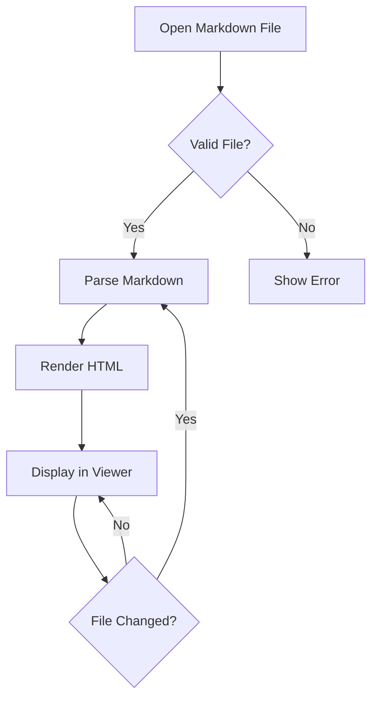
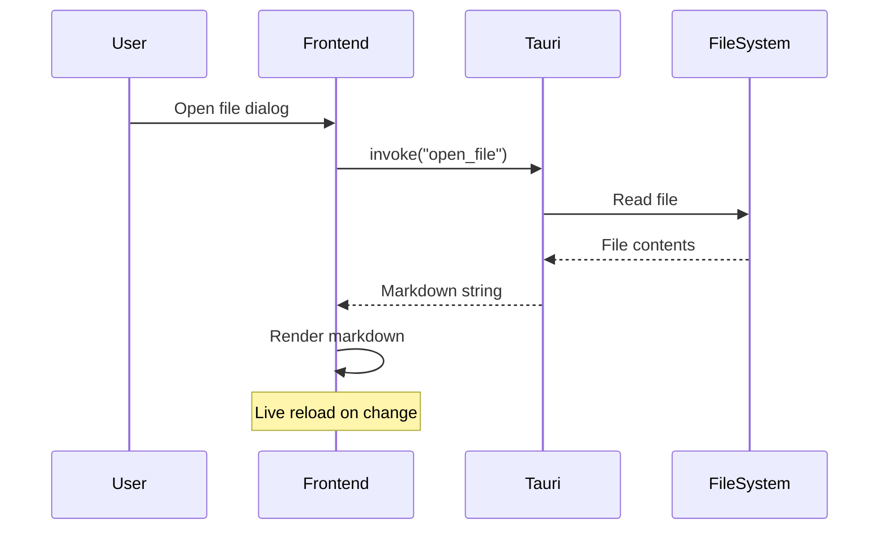

# Glyph Sample Document

A test file for verifying links and images.

## Links

Here are some links to test external link opening:

- [Unsplash](https://unsplash.com) — Free photos
- [GitHub](https://github.com/hamidfzm/glyph) — Glyph repository
- [Rust Programming Language](https://www.rust-lang.org)
- [Tauri Documentation](https://v2.tauri.app)
- [React Docs](https://react.dev)

### Anchor Links

These should navigate within the page, not open externally:

- [Go to Images](#images)
- [Go to Code](#code-block)

## Images

### Remote Images (Unsplash)

A mountain landscape:


A forest path:


### Placeholder Images


## Code Block

```rust
fn main() {
    println!("Hello from Glyph!");
}
```

```typescript
export function greet(name: string): string {
  return `Hello, ${name}!`;
}
```

## Mermaid Diagrams

### Flowchart



### Sequence Diagram



### Invalid Diagram (Error Fallback)

```mermaid
this is not valid mermaid syntax !!!
```

## Table

| Feature | Status |
|---------|--------|
| Links open in browser | Testing |
| External link icon | Testing |
| Remote images | Testing |
| Local images | Testing |
| Confirm dialog | Testing |

## Math

Einstein's famous equation $E = mc^2$ changed physics forever. The fine-structure constant is approximately $\alpha \approx 1/137$.

### Block Equations

The Gaussian integral:

$$\int_{-\infty}^{\infty} e^{-x^2} dx = \sqrt{\pi}$$

Euler's identity:

$$e^{i\pi} + 1 = 0$$

The Basel problem:

$$\sum_{n=1}^{\infty} \frac{1}{n^2} = \frac{\pi^2}{6}$$

### Matrix

$$\begin{pmatrix} a & b \\ c & d \end{pmatrix} \begin{pmatrix} x \\ y \end{pmatrix} = \begin{pmatrix} ax + by \\ cx + dy \end{pmatrix}$$

---

*End of sample document*
