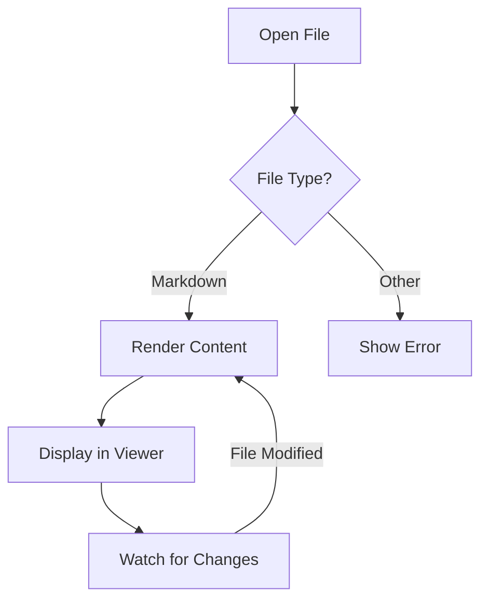
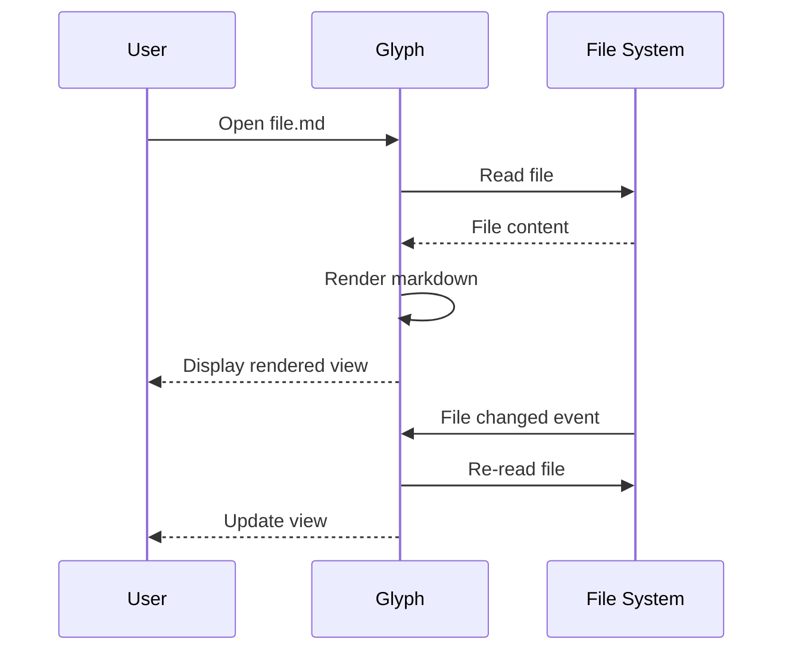
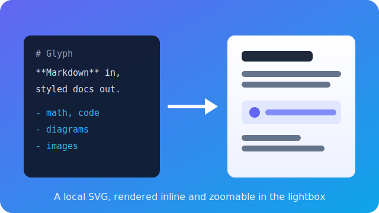
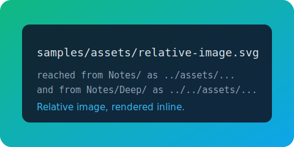

# Glyph Feature Showcase

This document demonstrates all the rendering features supported by Glyph. The YAML frontmatter at the top is rendered as the metadata block you see above this paragraph — `title`, `author`, `date`, and `tags` are recognised; other string keys appear in a small key/value list.

## Contents

- [Frontmatter](#frontmatter)
- [GitHub Flavored Markdown](#github-flavored-markdown)
- [Code Blocks](#code-blocks)
- [Math / LaTeX](#math--latex)
- [Mermaid Diagrams](#mermaid-diagrams)
- [D2 Diagrams](#d2-diagrams)
- [CSV / TSV Tables](#csv--tsv-tables)
- [Footnotes](#footnotes)
- [Emoji Shortcodes](#emoji-shortcodes)
- [Bidirectional Text](#bidirectional-text)
- [Blockquotes](#blockquotes)
- [Raw HTML](#raw-html)
- [Images](#images)
- [Links](#links)
- [Jupyter Notebooks](#jupyter-notebooks)
- [Canvas](#canvas)
- [AI Assistant](#ai-assistant)
- [Keyboard Shortcuts](#keyboard-shortcuts)

## Frontmatter

Glyph reads YAML frontmatter at the top of a document and renders it as a heading block. Recognised keys:

| Key | Renders as |
|---|---|
| `title` | Large gradient heading at the top |
| `author` | Subtle line under the title with a person icon |
| `date` | Same line as `author`, with a calendar icon (shown verbatim — no reformatting) |
| `tags` | Chip-style pills, each in a deterministic colour derived from the tag name |
| anything else | Small uppercase key / value list at the bottom of the block |

Documents without frontmatter render as before — no extra spacing, no empty card.

## GitHub Flavored Markdown

### Tables

| Feature | Status | Priority |
|---------|--------|----------|
| GFM tables | Done | High |
| Task lists | Done | High |
| Footnotes | Done | Medium |
| Strikethrough | Done | Medium |

### Task Lists

- [x] GitHub Flavored Markdown
- [x] Syntax highlighting with copy button
- [x] Math/LaTeX rendering
- [x] Mermaid diagrams
- [x] D2 diagrams
- [x] Tabs and in-document search
- [ ] Presentation mode

### Strikethrough & Autolinks

This text has ~~strikethrough~~ formatting. Visit https://github.com/hamidfzm/glyph for more info.

## Code Blocks

Hover over a code block to see the **copy button** in the top-right corner.

```typescript
function fibonacci(n: number): number {
  if (n <= 1) return n;
  return fibonacci(n - 1) + fibonacci(n - 2);
}

console.log(fibonacci(10)); // 55
```

```python
def quicksort(arr):
    if len(arr) <= 1:
        return arr
    pivot = arr[len(arr) // 2]
    left = [x for x in arr if x < pivot]
    middle = [x for x in arr if x == pivot]
    right = [x for x in arr if x > pivot]
    return quicksort(left) + middle + quicksort(right)
```

```rust
fn main() {
    let greeting = "Hello, Glyph!";
    println!("{greeting}");
}
```

## Math / LaTeX

Inline math: Einstein's famous equation $E = mc^2$ changed physics forever.

Block equations:

$$
\int_{-\infty}^{\infty} e^{-x^2} dx = \sqrt{\pi}
$$

$$
e^{i\pi} + 1 = 0
$$

Matrix notation:

$$\begin{pmatrix} a & b \\ c & d \end{pmatrix} \begin{pmatrix} x \\ y \end{pmatrix} = \begin{pmatrix} ax + by \\ cx + dy \end{pmatrix}$$

## Mermaid Diagrams





### `.mmd` source files

`.mmd` is recognised as either a raw Mermaid diagram source or a
MultiMarkdown document. Glyph sniffs the first non-comment line: if it
starts with a Mermaid declaration (`flowchart`, `graph`, `sequenceDiagram`,
`pie`, `mindmap`, `gantt`, etc.), the file is wrapped in a
` ```mermaid ` fence and rendered as a diagram. Anything else is treated
as plain markdown.

Open [[Flowchart]] for the diagram variant and [[Notes/Cooking]] for the
MultiMarkdown variant; both files use the `.mmd` extension.

## D2 Diagrams

Fenced code blocks tagged `d2` render as [D2](https://d2lang.com) diagrams,
theme-aware like Mermaid. D2 is well suited to architecture diagrams with
nested containers and labelled connections. Click any rendered diagram (D2 or
Mermaid) to open it in the lightbox, where you can zoom in and drag to move
around the detail.

```d2
direction: right

reader: Reader
glyph: Glyph {
  parse: Parse Markdown
  render: Render View
  parse -> render
}
reader -> glyph.parse: opens a file
glyph.render -> reader: rendered output
```

### `.d2` source files

A `.d2` file's whole body is diagram source. Glyph wraps it in a ` ```d2 `
fence and renders it directly, the same way `.mmd` files render as Mermaid.
`.d2` files show up in the workspace file tree and open straight into the
diagram viewer.

Open [[Architecture]] for a full example using nested containers, a person
and cylinder shape, and bidirectional connections.

## CSV / TSV Tables

Fenced code blocks tagged `csv` or `tsv` render as styled, scrollable
tables instead of raw text. The first row is treated as the header.
Quoted fields with embedded commas, quotes, and newlines are supported.

```csv
Name,Role,Commits
Alice,Maintainer,1240
Bob,Contributor,87
"Carol, Jr.",Reviewer,312
```

Tab-separated values work the same way with a `tsv` fence:

```tsv
Symbol	Price	Change
AAPL	189.50	+1.2%
GLPH	42.00	-0.4%
```

Malformed data falls back gracefully to the raw code block.

## Footnotes

Glyph supports GitHub-style footnotes[^1]. You can reference them multiple times[^2].

Footnotes can contain **rich text** and even code[^3].

[^1]: This is a simple footnote rendered at the bottom of the document.
[^2]: Footnotes include back-references so you can navigate back.
[^3]: This footnote contains a code example: `console.log("Hello from a footnote!")`.

## Emoji Shortcodes

Glyph converts GitHub-style emoji shortcodes to Unicode:

:wave: Hello! :rocket: Ship it! :tada: Celebration! :bug: Found a bug :white_check_mark: Tests passing :heart: Love it :thumbsup: Approved

## Bidirectional Text

Each paragraph resolves its own direction from its first strong character, so RTL and LTR text mix freely in one document.

این بند به فارسی نوشته شده و از راست به چپ نمایش داده می‌شود، حتی وقتی بقیه سند انگلیسی است.

هذه الفقرة مكتوبة بالعربية وتعرض من اليمين إلى اليسار.

Mixed inline text works too: the word سلام means "hello" in Persian, and code like `let x = 1` stays left-to-right even inside an RTL paragraph.

- فهرست‌ها هم پشتیبانی می‌شوند
- Bullet items keep their own direction per line

> نقل‌قول‌ها نیز جهت خود را از متن می‌گیرند.

## Blockquotes

> "The best way to predict the future is to invent it."
> — Alan Kay

## GitHub Alerts

> [!NOTE]
> Useful information that users should know, even when skimming content.

> [!TIP]
> Helpful advice for doing things better or more easily.

> [!IMPORTANT]
> Key information users need to know to achieve their goal.

> [!WARNING]
> Urgent info that needs immediate user attention to avoid problems.

> [!CAUTION]
> Advises about risks or negative outcomes of certain actions.

## Raw HTML

Glyph allows a curated subset of inline HTML — the elements GitHub renders inside READMEs.

Subscript: H<sub>2</sub>O. Superscript: E = mc<sup>2</sup>.

Press <kbd>Cmd</kbd>+<kbd>K</kbd> to open the command palette.

<details>
<summary>Click to expand</summary>

Hidden content lives inside `<details>` blocks. Useful for FAQs, troubleshooting steps, and changelog entries.

</details>

<p align="center">Centered paragraphs work too.</p>

## Images

### Remote Images


### Local Images

Relative paths resolve against this file's folder, so SVGs and other images committed next to your notes render inline:



Click any image to open it in the lightbox: zoom in/out, fit or actual size, drag to pan around a zoomed-in image, and use the arrow keys to move between them. Press `Esc` or click the backdrop to close.

The workspace also ships standalone image files in several formats. Open `diagram.png`, `diagram.jpg`, `diagram.gif`, or `diagram.svg` from the file tree: each opens in the image viewer, where the same controls (zoom in/out, fit, actual size, scroll or drag to pan) apply. SVGs render crisply at any zoom.

### Inline SVG

You can also embed SVG straight into the markdown. It renders inline from a sanitised allowlist (shapes, gradients, and text — no scripts or external references), which is handy for small, theme-friendly diagrams:

<svg viewBox="0 0 320 120" width="320" height="120" role="img" aria-label="Inline SVG gradient badge">
  <defs>
    <linearGradient id="demo" x1="0" y1="0" x2="1" y2="1">
      <stop offset="0" stop-color="#6366f1" />
      <stop offset="1" stop-color="#0ea5e9" />
    </linearGradient>
  </defs>
  <rect x="4" y="4" width="312" height="112" rx="16" fill="url(#demo)" />
  <circle cx="64" cy="60" r="34" fill="#ffffff" fill-opacity="0.18" />
  <path d="M50 60 l10 10 l20 -24" fill="none" stroke="#ffffff" stroke-width="5" stroke-linecap="round" stroke-linejoin="round" />
  <text x="190" y="68" text-anchor="middle" font-family="sans-serif" font-size="24" font-weight="700" fill="#ffffff">Inline SVG</text>
</svg>

## Links

- [Glyph on GitHub](https://github.com/hamidfzm/glyph) — External links open in your system browser
- [Go to Code Blocks](#code-blocks) — Anchor links navigate within the document

### Wikilinks

When you open a folder as a workspace, `[[note]]` style links resolve to other markdown files inside it. Open the `samples/` folder (`Cmd/Ctrl+Shift+O`) to make these resolve:

- [[Index]] — links to `Index.md` in this workspace
- [[Notes/Cooking|kitchen notes]] — display custom text, link to `Notes/Cooking.md`
- [[Index#setup]] — link to a heading inside another note
- [[Missing]] — broken link, renders muted (no target in workspace)
- [[Cooking]]

Opening this file on its own (no folder) treats every wikilink as broken.

### Note embeds

Prefix a wikilink with `!` to render its target inline instead of linking to
it. With the `samples/` folder open, these expand in place:

![[Notes/Ingredients]]

![[Index#Setup]]

Each embed sits in a bordered block; hover it for a control that opens the
source note. `![[note#heading]]` embeds only that section. A missing target or
heading shows a placeholder, and a note that embeds itself (directly or through
a chain) shows a circular-embed placeholder instead of looping.

### Relative links

Standard markdown links with relative paths resolve against this document's
folder and open in the workspace, including paths that walk up with `../`. With
the `samples/` folder open, these all open in-app:

- [the index](./Index.md) — a sibling markdown file
- [kitchen notes](Notes/Cooking.md) — a file in a subfolder
- [the canvas demo](./canvas-demo.canvas) — opens as a canvas board

Relative image paths resolve the same way. This SVG sits in a sibling folder:



`../` and `../../` are best seen from a nested note, where they have somewhere
to climb to:

- [Notes/Relative-Links](Notes/Relative-Links.md) — one level deep; uses `../` to reach the root
- [Notes/Deep/Deeper-Relative-Links](Notes/Deep/Deeper-Relative-Links.md) — two levels deep; uses `../../`

Targets that resolve **outside** the open folder are refused. From this root
README, `../` already points above `samples/`, so links like
`[escape](../outside.md)` and images like `` are not
followed and render nothing. Opening any of these files on its own (no folder)
leaves every relative link to the browser instead.

### Backlinks

When you have the `samples/` folder open, the **Backlinks** section under the file tree lists every other note that links to the current document. This file is referenced from [[Index]] and [[Notes/Cooking]], so opening either of them will show *this* file in their backlinks panel.

### Graph view

With the `samples/` folder open, press `Cmd/Ctrl+G` (or View → Open Graph) to see this workspace as a graph: every note is a node, every wikilink an edge. Hover a node to highlight its neighbours, click one to open that note, drag to pan, and scroll to zoom. `Missing` targets never appear (broken links are dropped), and notes nothing links to render muted.

This workspace is wired to make the graph worth a look: [[Index]] and [[Graph View]] act as hubs, the cooking notes ([[Notes/Cooking]], [[Ingredients]], [[Techniques]]) form a tight cluster, and `Scratchpad` sits off on its own as a muted orphan. The [[Graph View]] note is a full walkthrough of the feature.

### Export as a website

With the `samples/` folder open, `File → Export → Website…` turns this whole workspace into a static site: every note becomes a linked HTML page (the root `index.md`, or else this README, becomes `index.html`), wikilinks and relative links navigate between pages, images are copied alongside, Mermaid diagrams render as inline SVG, and a navigation sidebar ties it together. The same export runs headless from the terminal for CI publishing:

```bash
glyph samples/ --export-website ./site
```

### Wikilink autocomplete

In the editor or split view, typing `[[` opens a popup with workspace files. Keep typing to filter, press **Tab** or **Enter** to insert; the closing `]]` is added for you. Open this file in split view (`Cmd+E` cycles modes) and try typing `[[Co` to see it.

## Jupyter Notebooks

Glyph opens `.ipynb` files directly — no Jupyter required. Open `Notebook.ipynb` from the file tree (or run `glyph samples/Notebook.ipynb`) to see it. Notebooks are read-only and render each cell in order:

- **Markdown cells** get the full markdown pipeline above — math, code, Mermaid, alerts, the lot.
- **Code cells** are syntax-highlighted using the notebook's kernel language, with an `In [n]:` prompt in the gutter.
- **Outputs** render under their cell by richest type: images (`image/png`, `image/jpeg`, `image/svg+xml`), sanitised HTML, markdown, and plain text. Stream output and exception tracebacks keep their ANSI colours instead of showing raw escape codes. An `Out [n]:` prompt marks execution results.

Interactive outputs (Plotly, Vega, Jupyter widgets) aren't rendered yet — they show a short placeholder. Notebooks can't be edited in Glyph, so the mode toggle stays read-only: **view** shows the rendered cells, **edit** shows the raw `.ipynb` JSON as a syntax-highlighted source view, and **split** shows the JSON source and rendered cells side by side.

---

## Canvas

Glyph opens [JSON Canvas](https://jsoncanvas.org) (`.canvas`) files as an infinite, pan-and-zoom board. Open `canvas-demo.canvas` from the file tree (or run `glyph samples/canvas-demo.canvas`) to see it.

- **Cards** render markdown text, embedded images, links, and labelled groups.
- **Connections** are drawn as arrows between card sides, with optional labels.
- **Navigate** by scrolling to pan and `Cmd/Ctrl`+scroll (or pinch) to zoom; the toolbar has zoom and fit-to-content controls.

The mode toggle switches between reading and editing (split is hidden for canvas — the board itself is the editor):

- **View** is the read-only board.
- **Edit** is the full editor — drag to move cards, drag the corner handle to resize, drag a side connector to draw an edge, double-click a card to edit its markdown (or a link's URL, or a group's label) inline, and double-click a connection to label it. Use the selection toolbar to recolour (six presets or any custom colour) or delete. Dragging a group carries every card inside it, so groups work as movable regions, not just backdrops. Double-click empty board space to drop a new card right there, or use the `+ Card` / `+ Group` / `+ Link` toolbar buttons; `Delete`/`Backspace` removes the selection. Right-click works everywhere: empty space offers New card / New group / New link at the cursor, a card offers edit, colour, and delete, and a connection offers label editing and delete. Edits save as standard `.canvas` JSON (interoperable with Obsidian) and undo/redo with `Cmd/Ctrl+Z` / `Cmd/Ctrl+Shift+Z`.

Canvas boards integrate with the rest of the app: `File → Export` saves the board as a vector HTML page or a board-sized vector PDF that mirror the spatial layout, or linearises the cards into a Word or EPUB document; task-list checkboxes on cards are clickable in both view and edit mode, the status bar word count (and AI / read-aloud) reads the board's cards rather than its JSON, and canvases sync and back up like any other workspace file.

Create a fresh board from the file tree: right-click a folder (or the empty panel) and choose **New Canvas**.

---

## AI Assistant

Glyph ships an AI chat that converses about the open document with streaming replies, docked beside the text. Configure a provider in Settings → AI (a local Ollama server needs no API key; Claude and OpenAI take yours), then open the chat with the sparkle button in the tab bar or `Cmd+Shift+A`.

- **Quick actions** — Summarize / Explain / Translate / Simplify the document from the chips, the AI menu, or the right-click menu (select text first to run them on just the selection).
- **Locate quotes** — when the assistant quotes the document, click *Show in document* to scroll to and flash the passage.
- **Read aloud** — hover an assistant reply for Copy and Read Aloud.

Open [AI Playground](AI%20Playground.md) for a guided set of prompts to try against prepared content: a story to question, a table to interrogate, code to explain, and a Persian paragraph for right-to-left answers.

---

## Keyboard Shortcuts

| Shortcut | Action |
|----------|--------|
| `Cmd+O` | Open file(s) |
| `Cmd+Shift+O` | Open folder |
| `Cmd+K` | Command palette |
| `Cmd+G` | Workspace graph |
| `Cmd+P` | Print / Export to PDF |
| `Cmd+F` | Find in document |
| `Cmd+=` / `Cmd+-` | Zoom in / out |
| `Cmd+0` | Reset zoom |
| `Cmd+Z` / `Cmd+Shift+Z` | Undo / redo task checkbox toggles |
| `Cmd+B` | Toggle sidebar |
| `Cmd+Shift+A` | AI chat |
| `Cmd+,` | Settings |

*Try pressing `Cmd+F` to search this document, or `Cmd+P` to print / save as PDF. Use `File → Export` to save this page as HTML, Word (DOCX), EPUB, or PDF — math, code highlighting, tables, and images are carried straight from the rendered view.*
