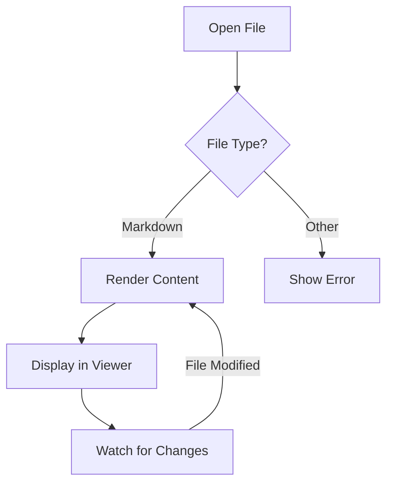
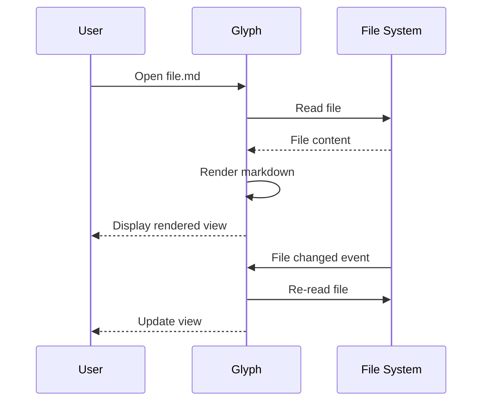

# Glyph Feature Showcase

This document demonstrates all the rendering features supported by Glyph. The YAML frontmatter above is automatically hidden from the rendered output.

## Contents

- [GitHub Flavored Markdown](#github-flavored-markdown)
- [Code Blocks](#code-blocks)
- [Math / LaTeX](#math--latex)
- [Mermaid Diagrams](#mermaid-diagrams)
- [Footnotes](#footnotes)
- [Emoji Shortcodes](#emoji-shortcodes)
- [Blockquotes](#blockquotes)
- [Raw HTML](#raw-html)
- [Images](#images)
- [Links](#links)
- [Keyboard Shortcuts](#keyboard-shortcuts)

## GitHub Flavored Markdown

### Tables

| Feature | Status | Priority |
|---------|--------|----------|
| GFM tables | Done | High |
| Task lists | Done | High |
| Footnotes | Done | Medium |
| Strikethrough | Done | Medium |

### Task Lists

- [x] GitHub Flavored Markdown
- [x] Syntax highlighting with copy button
- [x] Math/LaTeX rendering
- [x] Mermaid diagrams
- [x] Tabs and in-document search
- [ ] Presentation mode

### Strikethrough & Autolinks

This text has ~~strikethrough~~ formatting. Visit https://github.com/hamidfzm/glyph for more info.

## Code Blocks

Hover over a code block to see the **copy button** in the top-right corner.

```typescript
function fibonacci(n: number): number {
  if (n <= 1) return n;
  return fibonacci(n - 1) + fibonacci(n - 2);
}

console.log(fibonacci(10)); // 55
```

```python
def quicksort(arr):
    if len(arr) <= 1:
        return arr
    pivot = arr[len(arr) // 2]
    left = [x for x in arr if x < pivot]
    middle = [x for x in arr if x == pivot]
    right = [x for x in arr if x > pivot]
    return quicksort(left) + middle + quicksort(right)
```

```rust
fn main() {
    let greeting = "Hello, Glyph!";
    println!("{greeting}");
}
```

## Math / LaTeX

Inline math: Einstein's famous equation $E = mc^2$ changed physics forever.

Block equations:

$$
\int_{-\infty}^{\infty} e^{-x^2} dx = \sqrt{\pi}
$$

$$
e^{i\pi} + 1 = 0
$$

Matrix notation:

$$\begin{pmatrix} a & b \\ c & d \end{pmatrix} \begin{pmatrix} x \\ y \end{pmatrix} = \begin{pmatrix} ax + by \\ cx + dy \end{pmatrix}$$

## Mermaid Diagrams





## Footnotes

Glyph supports GitHub-style footnotes[^1]. You can reference them multiple times[^2].

Footnotes can contain **rich text** and even code[^3].

[^1]: This is a simple footnote rendered at the bottom of the document.
[^2]: Footnotes include back-references so you can navigate back.
[^3]: This footnote contains a code example: `console.log("Hello from a footnote!")`.

## Emoji Shortcodes

Glyph converts GitHub-style emoji shortcodes to Unicode:

:wave: Hello! :rocket: Ship it! :tada: Celebration! :bug: Found a bug :white_check_mark: Tests passing :heart: Love it :thumbsup: Approved

## Blockquotes

> "The best way to predict the future is to invent it."
> — Alan Kay

## GitHub Alerts

> [!NOTE]
> Useful information that users should know, even when skimming content.

> [!TIP]
> Helpful advice for doing things better or more easily.

> [!IMPORTANT]
> Key information users need to know to achieve their goal.

> [!WARNING]
> Urgent info that needs immediate user attention to avoid problems.

> [!CAUTION]
> Advises about risks or negative outcomes of certain actions.

## Raw HTML

Glyph allows a curated subset of inline HTML — the elements GitHub renders inside READMEs.

Subscript: H<sub>2</sub>O. Superscript: E = mc<sup>2</sup>.

Press <kbd>Cmd</kbd>+<kbd>K</kbd> to open the command palette.

<details>
<summary>Click to expand</summary>

Hidden content lives inside `<details>` blocks. Useful for FAQs, troubleshooting steps, and changelog entries.

</details>

<p align="center">Centered paragraphs work too.</p>

## Images

### Remote Images


## Links

- [Glyph on GitHub](https://github.com/hamidfzm/glyph) — External links open in your system browser
- [Go to Code Blocks](#code-blocks) — Anchor links navigate within the document

### Wikilinks

When you open a folder as a workspace, `[[note]]` style links resolve to other markdown files inside it. Open the `samples/` folder (`Cmd/Ctrl+Shift+O`) to make these resolve:

- [[Index]] — links to `Index.md` in this workspace
- [[Notes/Cooking|kitchen notes]] — display custom text, link to `Notes/Cooking.md`
- [[Index#setup]] — link to a heading inside another note
- [[Missing]] — broken link, renders muted (no target in workspace)
- [[Cooking]]

Opening this file on its own (no folder) treats every wikilink as broken.

### Backlinks

When you have the `samples/` folder open, the **Backlinks** section under the file tree lists every other note that links to the current document. This file is referenced from [[Index]] and [[Notes/Cooking]], so opening either of them will show *this* file in their backlinks panel.

### Wikilink autocomplete

In the editor or split view, typing `[[` opens a popup with workspace files. Keep typing to filter, press **Tab** or **Enter** to insert; the closing `]]` is added for you. Open this file in split view (`Cmd+E` cycles modes) and try typing `[[Co` to see it.

---

## Keyboard Shortcuts

| Shortcut | Action |
|----------|--------|
| `Cmd+O` | Open file(s) |
| `Cmd+Shift+O` | Open folder |
| `Cmd+P` | Print / Export to PDF |
| `Cmd+F` | Find in document |
| `Cmd+=` / `Cmd+-` | Zoom in / out |
| `Cmd+0` | Reset zoom |
| `Cmd+B` | Toggle sidebar |
| `Cmd+,` | Settings |

*Try pressing `Cmd+F` to search this document, or `Cmd+P` to print / save as PDF.*
