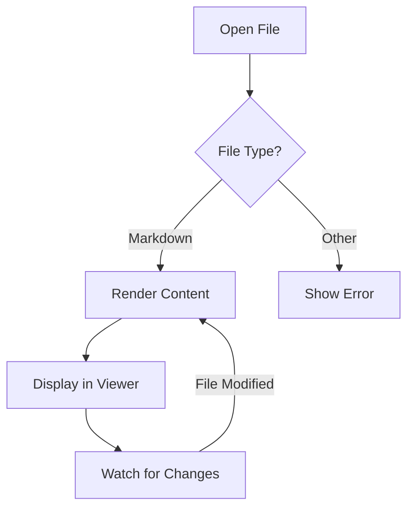
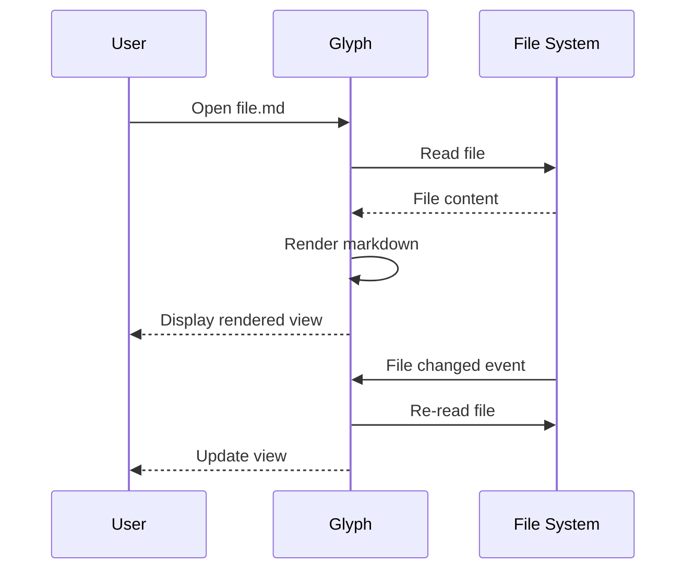

# Glyph Feature Showcase

This document demonstrates all the rendering features supported by Glyph. The YAML frontmatter at the top is rendered as the metadata block you see above this paragraph — `title`, `author`, `date`, and `tags` are recognised; other string keys appear in a small key/value list.

## Contents

- [Frontmatter](#frontmatter)
- [GitHub Flavored Markdown](#github-flavored-markdown)
- [Code Blocks](#code-blocks)
- [Math / LaTeX](#math--latex)
- [Mermaid Diagrams](#mermaid-diagrams)
- [CSV / TSV Tables](#csv--tsv-tables)
- [Footnotes](#footnotes)
- [Emoji Shortcodes](#emoji-shortcodes)
- [Blockquotes](#blockquotes)
- [Raw HTML](#raw-html)
- [Images](#images)
- [Links](#links)
- [Jupyter Notebooks](#jupyter-notebooks)
- [Canvas](#canvas)
- [Keyboard Shortcuts](#keyboard-shortcuts)

## Frontmatter

Glyph reads YAML frontmatter at the top of a document and renders it as a heading block. Recognised keys:

| Key | Renders as |
|---|---|
| `title` | Large gradient heading at the top |
| `author` | Subtle line under the title with a person icon |
| `date` | Same line as `author`, with a calendar icon (shown verbatim — no reformatting) |
| `tags` | Chip-style pills, each in a deterministic colour derived from the tag name |
| anything else | Small uppercase key / value list at the bottom of the block |

Documents without frontmatter render as before — no extra spacing, no empty card.

## GitHub Flavored Markdown

### Tables

| Feature | Status | Priority |
|---------|--------|----------|
| GFM tables | Done | High |
| Task lists | Done | High |
| Footnotes | Done | Medium |
| Strikethrough | Done | Medium |

### Task Lists

- [x] GitHub Flavored Markdown
- [x] Syntax highlighting with copy button
- [x] Math/LaTeX rendering
- [x] Mermaid diagrams
- [x] Tabs and in-document search
- [ ] Presentation mode

### Strikethrough & Autolinks

This text has ~~strikethrough~~ formatting. Visit https://github.com/hamidfzm/glyph for more info.

## Code Blocks

Hover over a code block to see the **copy button** in the top-right corner.

```typescript
function fibonacci(n: number): number {
  if (n <= 1) return n;
  return fibonacci(n - 1) + fibonacci(n - 2);
}

console.log(fibonacci(10)); // 55
```

```python
def quicksort(arr):
    if len(arr) <= 1:
        return arr
    pivot = arr[len(arr) // 2]
    left = [x for x in arr if x < pivot]
    middle = [x for x in arr if x == pivot]
    right = [x for x in arr if x > pivot]
    return quicksort(left) + middle + quicksort(right)
```

```rust
fn main() {
    let greeting = "Hello, Glyph!";
    println!("{greeting}");
}
```

## Math / LaTeX

Inline math: Einstein's famous equation $E = mc^2$ changed physics forever.

Block equations:

$$
\int_{-\infty}^{\infty} e^{-x^2} dx = \sqrt{\pi}
$$

$$
e^{i\pi} + 1 = 0
$$

Matrix notation:

$$\begin{pmatrix} a & b \\ c & d \end{pmatrix} \begin{pmatrix} x \\ y \end{pmatrix} = \begin{pmatrix} ax + by \\ cx + dy \end{pmatrix}$$

## Mermaid Diagrams





### `.mmd` source files

`.mmd` is recognised as either a raw Mermaid diagram source or a
MultiMarkdown document. Glyph sniffs the first non-comment line: if it
starts with a Mermaid declaration (`flowchart`, `graph`, `sequenceDiagram`,
`pie`, `mindmap`, `gantt`, etc.), the file is wrapped in a
` ```mermaid ` fence and rendered as a diagram. Anything else is treated
as plain markdown.

Open [[Flowchart]] for the diagram variant and [[Notes/Cooking]] for the
MultiMarkdown variant; both files use the `.mmd` extension.

## CSV / TSV Tables

Fenced code blocks tagged `csv` or `tsv` render as styled, scrollable
tables instead of raw text. The first row is treated as the header.
Quoted fields with embedded commas, quotes, and newlines are supported.

```csv
Name,Role,Commits
Alice,Maintainer,1240
Bob,Contributor,87
"Carol, Jr.",Reviewer,312
```

Tab-separated values work the same way with a `tsv` fence:

```tsv
Symbol	Price	Change
AAPL	189.50	+1.2%
GLPH	42.00	-0.4%
```

Malformed data falls back gracefully to the raw code block.

## Footnotes

Glyph supports GitHub-style footnotes[^1]. You can reference them multiple times[^2].

Footnotes can contain **rich text** and even code[^3].

[^1]: This is a simple footnote rendered at the bottom of the document.
[^2]: Footnotes include back-references so you can navigate back.
[^3]: This footnote contains a code example: `console.log("Hello from a footnote!")`.

## Emoji Shortcodes

Glyph converts GitHub-style emoji shortcodes to Unicode:

:wave: Hello! :rocket: Ship it! :tada: Celebration! :bug: Found a bug :white_check_mark: Tests passing :heart: Love it :thumbsup: Approved

## Blockquotes

> "The best way to predict the future is to invent it."
> — Alan Kay

## GitHub Alerts

> [!NOTE]
> Useful information that users should know, even when skimming content.

> [!TIP]
> Helpful advice for doing things better or more easily.

> [!IMPORTANT]
> Key information users need to know to achieve their goal.

> [!WARNING]
> Urgent info that needs immediate user attention to avoid problems.

> [!CAUTION]
> Advises about risks or negative outcomes of certain actions.

## Raw HTML

Glyph allows a curated subset of inline HTML — the elements GitHub renders inside READMEs.

Subscript: H<sub>2</sub>O. Superscript: E = mc<sup>2</sup>.

Press <kbd>Cmd</kbd>+<kbd>K</kbd> to open the command palette.

<details>
<summary>Click to expand</summary>

Hidden content lives inside `<details>` blocks. Useful for FAQs, troubleshooting steps, and changelog entries.

</details>

<p align="center">Centered paragraphs work too.</p>

## Images

### Remote Images


## Links

- [Glyph on GitHub](https://github.com/hamidfzm/glyph) — External links open in your system browser
- [Go to Code Blocks](#code-blocks) — Anchor links navigate within the document

### Wikilinks

When you open a folder as a workspace, `[[note]]` style links resolve to other markdown files inside it. Open the `samples/` folder (`Cmd/Ctrl+Shift+O`) to make these resolve:

- [[Index]] — links to `Index.md` in this workspace
- [[Notes/Cooking|kitchen notes]] — display custom text, link to `Notes/Cooking.md`
- [[Index#setup]] — link to a heading inside another note
- [[Missing]] — broken link, renders muted (no target in workspace)
- [[Cooking]]

Opening this file on its own (no folder) treats every wikilink as broken.

### Backlinks

When you have the `samples/` folder open, the **Backlinks** section under the file tree lists every other note that links to the current document. This file is referenced from [[Index]] and [[Notes/Cooking]], so opening either of them will show *this* file in their backlinks panel.

### Wikilink autocomplete

In the editor or split view, typing `[[` opens a popup with workspace files. Keep typing to filter, press **Tab** or **Enter** to insert; the closing `]]` is added for you. Open this file in split view (`Cmd+E` cycles modes) and try typing `[[Co` to see it.

## Jupyter Notebooks

Glyph opens `.ipynb` files directly — no Jupyter required. Open `Notebook.ipynb` from the file tree (or run `glyph samples/Notebook.ipynb`) to see it. Notebooks are read-only and render each cell in order:

- **Markdown cells** get the full markdown pipeline above — math, code, Mermaid, alerts, the lot.
- **Code cells** are syntax-highlighted using the notebook's kernel language, with an `In [n]:` prompt in the gutter.
- **Outputs** render under their cell by richest type: images (`image/png`, `image/jpeg`, `image/svg+xml`), sanitised HTML, markdown, and plain text. Stream output and exception tracebacks keep their ANSI colours instead of showing raw escape codes. An `Out [n]:` prompt marks execution results.

Interactive outputs (Plotly, Vega, Jupyter widgets) aren't rendered yet — they show a short placeholder. Notebooks can't be edited in Glyph, so the mode toggle stays read-only: **view** shows the rendered cells, **edit** shows the raw `.ipynb` JSON as a syntax-highlighted source view, and **split** shows the JSON source and rendered cells side by side.

---

## Canvas

Glyph opens [JSON Canvas](https://jsoncanvas.org) (`.canvas`) files as an infinite, pan-and-zoom board. Open `canvas-demo.canvas` from the file tree (or run `glyph samples/canvas-demo.canvas`) to see it.

- **Cards** render markdown text, embedded images, links, and labelled groups.
- **Connections** are drawn as arrows between card sides, with optional labels.
- **Navigate** by scrolling to pan and `Cmd/Ctrl`+scroll (or pinch) to zoom; the toolbar has zoom and fit-to-content controls.

The mode toggle switches between reading and editing (split is hidden for canvas — the board itself is the editor):

- **View** is the read-only board.
- **Edit** is the full editor — drag to move cards, drag the corner handle to resize, drag a side connector to draw an edge, double-click a card to edit its markdown (or a link's URL, or a group's label) inline, and double-click a connection to label it. Use the selection toolbar to recolour (six presets or any custom colour) or delete. Dragging a group carries every card inside it, so groups work as movable regions, not just backdrops. Double-click empty board space to drop a new card right there, or use the `+ Card` / `+ Group` / `+ Link` toolbar buttons; `Delete`/`Backspace` removes the selection. Right-click works everywhere: empty space offers New card / New group / New link at the cursor, a card offers edit, colour, and delete, and a connection offers label editing and delete. Edits save as standard `.canvas` JSON (interoperable with Obsidian) and undo/redo with `Cmd/Ctrl+Z` / `Cmd/Ctrl+Shift+Z`.

Canvas boards integrate with the rest of the app: `File → Export` saves the board as a vector HTML page or a board-sized vector PDF that mirror the spatial layout, or linearises the cards into a Word or EPUB document; task-list checkboxes on cards are clickable in both view and edit mode, the status bar word count (and AI / read-aloud) reads the board's cards rather than its JSON, and canvases sync and back up like any other workspace file.

Create a fresh board from the file tree: right-click a folder (or the empty panel) and choose **New Canvas**.

---

## Keyboard Shortcuts

| Shortcut | Action |
|----------|--------|
| `Cmd+O` | Open file(s) |
| `Cmd+Shift+O` | Open folder |
| `Cmd+K` | Command palette |
| `Cmd+P` | Print / Export to PDF |
| `Cmd+F` | Find in document |
| `Cmd+=` / `Cmd+-` | Zoom in / out |
| `Cmd+0` | Reset zoom |
| `Cmd+Z` / `Cmd+Shift+Z` | Undo / redo task checkbox toggles |
| `Cmd+B` | Toggle sidebar |
| `Cmd+,` | Settings |

*Try pressing `Cmd+F` to search this document, or `Cmd+P` to print / save as PDF. Use `File → Export` to save this page as HTML, Word (DOCX), EPUB, or PDF — math, code highlighting, tables, and images are carried straight from the rendered view.*
